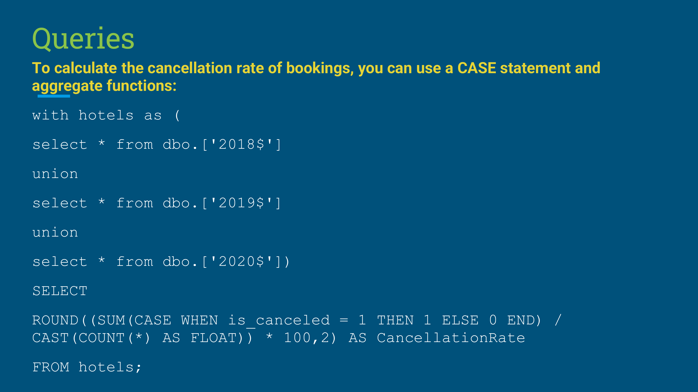
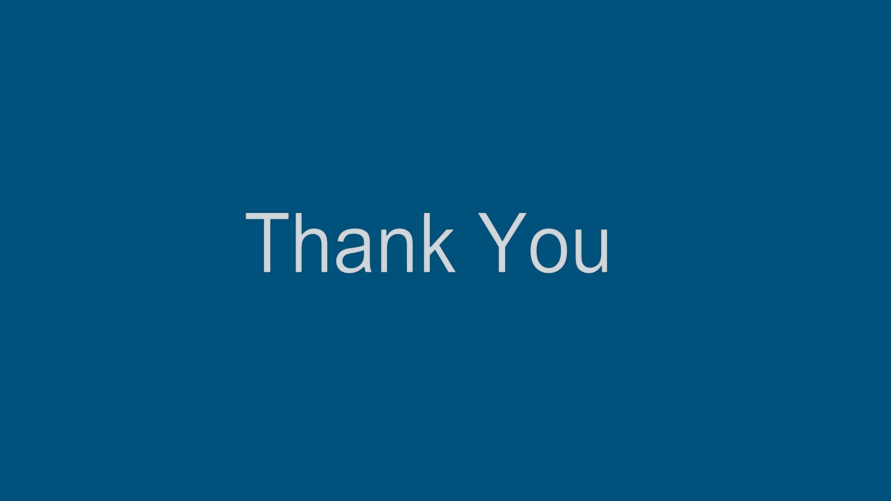

# Hotel-Revenue-Dashborad
## 🔧 Build With:
   

## 🛢️ Database Used:

## ☁️ Data Sourced:
<a href="https://absentdata.com/wp-content/uploads/2021/05/hotel_revenue_historical_full-2.xlsx">hotel_revenue_historical_full-2.xlsx</a>

## 🌐 Domain:

## What is a Hotel Revenue?
Hotel revenue refers to the total income generated by a hotel through guest stays, additional services like meals, and other offerings. A hotel revenue dashboard provides a centralized view of key metrics like occupancy rates, average daily rates, and booking trends. This real-time data empowers hotels to make informed decisions about pricing, marketing, and guest services, ultimately maximizing profitability and ensuring long-term success.

### How this Hotel Revenue Dashboard Serves:
Imagine having a cockpit view of your hotel's financial health. That's precisely what a hotel revenue dashboard offers – a centralized hub displaying key performance indicators (KPIs) that paint a clear picture of your income streams.

**Here's why this dashboard is essential for your hotel's success:**

**Instant Insights:** No more digging through spreadsheets! The dashboard provides a quick and easy way to see how your hotel is performing in terms of revenue. Occupancy rates, average daily rates (ADR), and total revenue are all readily available at a glance.

**Trend Tracker:** The power of the dashboard goes beyond static numbers. By tracking KPIs over time, you can identify trends and patterns. Are occupancy rates showing a seasonal dip? The dashboard empowers you to adjust pricing or marketing strategies proactively.

**Data-Driven Decisions:** Stop relying on gut feeling! The dashboard equips you with real-time data to make informed decisions. Seeing a decline in bookings during a specific week? You can use this insight to launch targeted promotions and attract more guests.

**Clear Communication:** The dashboard fosters transparency and facilitates communication. Share it with stakeholders like hotel managers, investors, or ownership groups. Everyone will be on the same page regarding revenue goals and progress.

**Unveiling Opportunities:** Sometimes, the data reveals hidden gems. The dashboard can help pinpoint areas where your hotel might be losing revenue. Perhaps underperforming room types, inefficient pricing strategies, or weak guest acquisition channels need your attention.

By harnessing the power of your hotel revenue dashboard, you gain a deeper understanding of your revenue streams.  This translates to better decision-making, allowing you to optimize pricing, marketing efforts, and guest services, ultimately driving profitability and propelling your hotel to new heights of success.

## How It Works:

### Homepage:

### Having PPT Slides for **References** and **Flow of Work** :

### Conclusions:

It displays a variety of hotel performance metrics, including:

**Revenue:** This section shows the total hotel revenue for a specific period. In this case, it displays $10.23 million.

**Average Daily Rate (ADR):** This metric reflects the average amount of revenue a hotel receives per occupied room per night. The dashboard displays an average ADR of $104.44.

**Total Nights Stayed:** This section shows the total number of nights booked by guests during the specified timeframe. The value is 367,940 nights.

**Cancellation Rate:** This metric indicates the percentage of reservations that were cancelled. The dashboard shows a cancellation rate of 26.58%.

**Discounts:** This section reflects the average discount provided to guests on their reservations. The value is 25.80%.

**Repeat Customers:** This metric indicates the percentage of guests who have booked with the hotel before. In this case, the dashboard shows that 96.00% of guests are repeat customers.

The bottom portion of the dashboard seems to be focused on booking sources and revenue trends. Here are some of the details I can glean from that section:

**Bookings by Different Corporates:** This section likely shows the number of bookings made by different corporate clients. There seems to be a corporate client named "Market_segment" that has booked 1,000 rooms.

**Revenue with Respect to Year over Year:** This section appears to show a comparison of revenue between the current year and the previous year. There seems to be a 13.85% increase in revenue year-over-year.

**Increase in Bookings Count per Year:** This section likely displays a comparison of the number of bookings between the current year and previous years. It seems like booking counts have increased by 14% year-over-year.

**Types of Meals Ordered:** This section may show the breakdown of meals booked by guests (e.g., Bed and Breakfast (BB), Half Board (HB), Full Board (FB)). It appears that the most popular meal option is Half Board (HB).

Overall, this dashboard provides a good snapshot of the hotel’s revenue performance and booking trends.  With this information, hotel management can make data-driven decisions to optimize pricing strategies, marketing efforts, and guest services.

## Summary:
This can be further developed with a few minor drawbacks to consider for future improvements.
 
